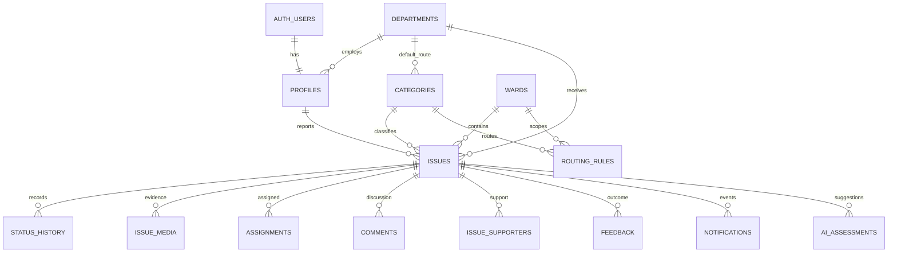

# Foundation decisions and schema draft

## Architecture

Keep the plan's Next.js + TypeScript frontend and Supabase PostgreSQL/Auth/Storage backend. The first delivery is a local prototype, not a production Site deployment. Use one app for citizen, officer and administrator routes; extract shared UI once real reuse exists. Tailwind, accessible component primitives, React Hook Form, map and Supabase clients can be added in their implementation slices rather than creating unused scaffolding.

The initial UI uses deep teal (#006b61), navy text (#142d3a), white surfaces and a cool grey canvas. Body text is 16px; focus outlines are visible; small screens stack the workspace. The four demo panels are clickable wireframes, not permission boundaries.

## Working assumptions

- Roles: CITIZEN, OFFICER, DEPARTMENT_ADMIN, SYSTEM_ADMIN.
- Fictional pilot: Ward 01 / Central and Ward 02 / Riverside; no real jurisdiction inferred.
- Categories map to Sanitation, Public Works, Water Services, Street Lighting.
- Adopt section 7 of the project plan without additional transitions.
- Municipality, ward geometry, reopen window, automatic closure, retention and SLA values require later configuration; do not invent policy defaults.

## Schema relationships

The initial migration creates only profiles and configuration tables. Issue tables in the diagram are a draft for subsequent sprints, with fields specified in plan section 11. Add issue creation and initial history in one transaction; never ship client-driven privileged transitions. Use unique supporter pairs, one active assignment per issue, unique references, notification idempotency keys and immutable history. Store internal notes separately from public-safe projections. Audit role, routing and status changes in trusted transactions.

RLS is enabled immediately with no client grants in the initial migration. Sprint 1 must add narrowly scoped policies and test them before exposing configuration/profile reads. Never authorize from user-editable metadata or a client-selected role. Service credentials remain server-only.

## Demo acceptance walkthrough

Open the prototype, preview the overflowing-bin report, verify it, assign the sample officer, start work, preview resolution and confirm with a rating. The tracker should show all six primary lifecycle states. Restart clears the timeline. Buttons prohibit skipping the lifecycle in the demo; this is not security enforcement. Real photo/location validation arrives in Sprint 2; trusted transitions/evidence and audit history in Sprint 3; confirmation/reopen/rating persistence in Sprint 4.
